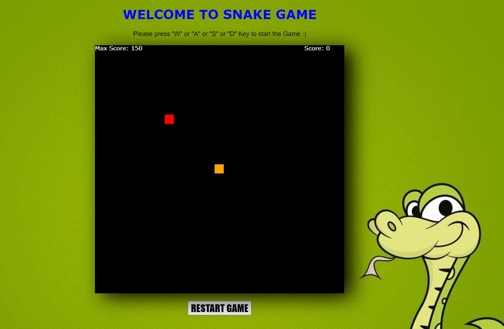
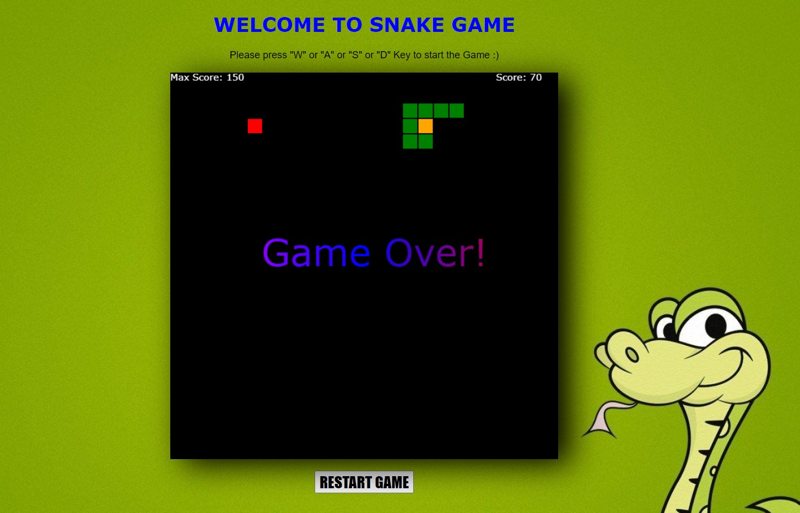

# Snake-Game

## What it does?
* It is a simple recreation of childhood nokia snake game with visually attractive and efficient Game Play.

## Technologies Used 💻
* JavaScript 
* HTML
* CSS

## How To start? ⁉
* Use keys 'W' or 'A' or 'D' or 'S' for starting or movement of snake game.

* Red colored box is the Food for snake to be eaten and Orange colored box is Snake.

For Movement of Snake:

* 'W' for moving upwards

* 'A' for moving left side

* 'S' for moving Downwards

* 'D' for moving right side

* To restart the game press the restart button below the canvas provided.

## Screen Shots 📜

